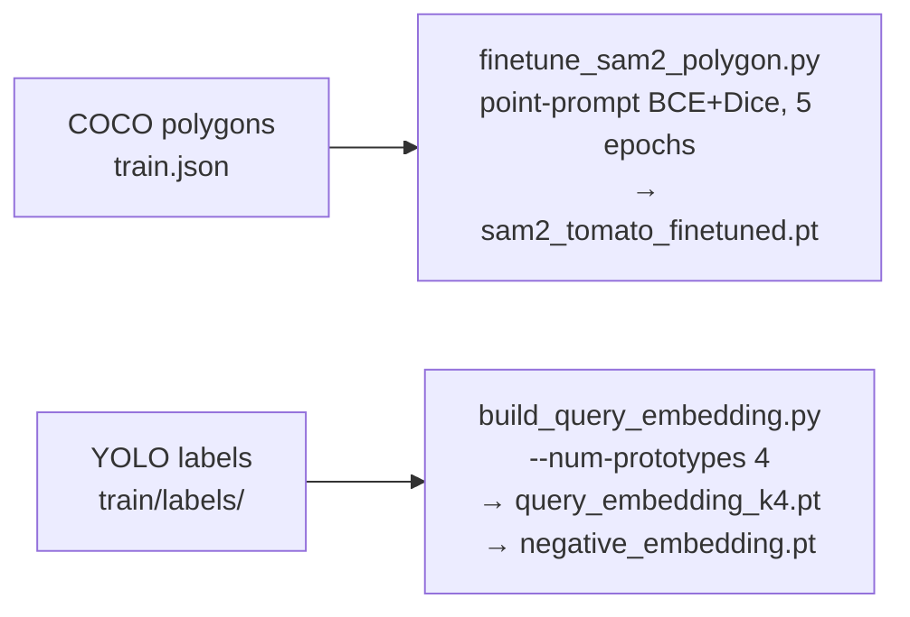

# Sprint 4 — Perception Architecture

**Sprint 4 final result:** mAP=0.377 (+121% vs Sprint 3 baseline of 0.170)

---

## 1. What the baseline (0.170) was doing wrong

Sprint 3 left three concrete gaps:

| Gap | What it caused |
|-----|----------------|
| **Single-mean query embedding** | All tomato patch vectors averaged into one vector. Ripe/unripe, lit/shaded, clustered tomatoes have different visual distributions — a single mean collapses them. High precision, low recall. |
| **Bounding-box fine-tune, point-prompt inference** | SAM2 was fine-tuned using box prompts (rect drawn around COCO annotation). At runtime, AMG uses grid *point* prompts. Prompt-type mismatch means the fine-tuned weights generalise poorly. |
| **Hard cosine threshold on binary patch mask** | A patch was either "inside the mask" or not — 0 or 1. Boundary patches get the same weight as centre patches, adding noise to the cosine similarity. |

---

## 2. What changed in Sprint 4 (S4.12)

Four targeted fixes, stacked incrementally:

### Fix 1 — Soft patch coverage (E1)
**Before:** `w_i ∈ {0, 1}` (binary — patch inside mask or not)
**After:** `w_i ∈ [0, 1]` — the fraction of patch cell `i` covered by the SAM2 mask

This makes the cosine similarity score smoother at mask boundaries. Masks that partially clip a tomato are scored based on how much they cover, not a hard in/out decision.

### Fix 2 — k-means prototypes, k=4 (E2)
**Before:** `query_embedding.pt` — shape `(768,)`, mean of all tomato patches
**After:** `query_embedding_k4.pt` — shape `(4, 768)`, 4 k-means++ cluster centres

At inference, each mask is scored against all 4 prototypes and the max is taken. This captures the multi-modal distribution of tomato appearances — one prototype for ripe red, one for partially-occluded, etc. **This single change was the largest gain: 0.170 → 0.287.**

### Fix 3 — Point-prompt SAM2 fine-tune (E4)
**Before:** `finetune_sam2_decoder.py` — box prompts from bounding rect of COCO polygon
**After:** `finetune_sam2_polygon.py` — random interior points sampled from COCO polygon

Training and runtime now use the same prompt type. The fine-tuned decoder generalises correctly to AMG's grid-point prompts.

### Fix 4 — Score fusion (α=0.7)
**Before:** `score = dino_sim` (pure DINOv2 cosine similarity)
**After:** `score = 0.7 · dino_sim + 0.3 · pred_iou`

SAM2's `pred_iou` captures mask *geometric* quality (coherent shape, well-bounded edges). DINOv2 captures *semantic* content. Blending both signals at 70/30 filters out geometrically poor masks that happen to have high semantic similarity, boosting precision.

---

## 3. How S4.12 works end-to-end

```
Frame (RGB from RealSense D435i)
        │
        ▼
  preprocess_for_dino()  →  (3, 518, 518) float32
        │
        ├──────────────────────────────────────────┐
        │                                          │
        ▼                                          ▼
  DINOv2 ViT-B/14                       SAM2 AMG (pts=28)
  extract patch tokens                  dense 28×28 grid prompts
  (1369, 768) → L2-norm                 → 784 masks decoded
        │                                          │
        └──────────────┬───────────────────────────┘
                       │ both needed per mask
                       ▼
             Per-mask scoring
             ─────────────────────────────────────────
             1. _mask_to_patch_coverage()
                → w_i = overlap fraction [0,1] per patch
             2. coverage-weighted cosine vs k=4 prototypes
                → sim_k = Σ w_i·cos(f_i, q_k) / Σ w_i
                → tomato_sim = max(sim_1..4)
             3. contrastive suppression
                → dino_sim = tomato_sim − 1.0·neg_sim
             4. score fusion
                → score = 0.7·dino_sim + 0.3·pred_iou
             5. score ≥ 0.35 → keep
             ─────────────────────────────────────────
                       │
                       ▼
             Box NMS (IoU threshold=0.5)
             max 30 detections per frame
                       │
                       ▼
             list[dict]: box / score / label / mask
```

### Score formula (full)

$$\text{score} = \alpha \cdot \left(\max_k \frac{\sum_i w_i \cos(f_i, q_k)}{\sum_i w_i} - \lambda \cdot \frac{\sum_i w_i \cos(f_i, n)}{\sum_i w_i}\right) + (1-\alpha) \cdot \text{pred\_iou}$$

| Symbol | Value (S4.12) | What it is |
|--------|--------------|------------|
| $f_i$ | — | L2-normalised DINOv2 patch token at position $i$ |
| $w_i$ | continuous [0,1] | fraction of patch cell $i$ covered by SAM2 mask |
| $q_k$ | k=4 cluster centres | k-means++ prototypes from training tomato patches |
| $n$ | background mean | negative embedding (mean of non-tomato patches) |
| $\text{pred\_iou}$ | from SAM2 | SAM2's own mask quality estimate |
| $\alpha$ | **0.7** | `--dino-weight` |
| $\lambda$ | **1.0** | `--negative-weight` |

---

## 4. One-time training pipeline (offline, run once)



That's the full training surface for S4.12. LoRA DINOv2 (`finetune_dino_lora.py`) is implemented but blocked on ROCm.

---

## 5. mAP progression — what each change actually contributed

| Step | Change | mAP | Δ |
|------|--------|-----|---|
| S3.10 baseline | AMG pts=20, box-prompt FT, single-mean query | 0.170 | — |
| E1+E2+E4 | Soft coverage + k=4 prototypes + point-prompt FT | 0.287 | **+69%** |
| pts=24, max=30 | More proposals, cap lifted | 0.328 | +14% |
| Score fusion | α=0.7, conf=0.35 | 0.360 | +10% |
| pts=28 | 784 proposals (28×28 grid) | **0.377** | +5% |

The steep early gains came from fixing the fundamental mismatch (single prototype, wrong prompt type). The later gains are diminishing returns from proposal density — a clear signal the ceiling is the feature quality, not the proposal count.

---

## 6. File map

| File | Role | Status |
|---|---|---|
| `detectors/sam2_amg_detector.py` | Primary detector (E1, E2, E4) | **Active — Sprint 4 final** |
| `detectors/sam2_semantic_detector.py` | E3 — heatmap-guided point prompts | Implemented, mAP=0.114 (slower path abandoned) |
| `detectors/dino_sam2_detector.py` | Sprint 2 — DINOv2 proposals + SAM2 | Kept as ablation baseline |
| `tools/finetune_sam2_polygon.py` | Point-prompt SAM2 fine-tune (E4) | **Active** |
| `tools/build_query_embedding.py` | k-prototype query builder (E2) | **Active** |
| `tools/mine_hard_negatives.py` | FP-based hard negative mining (E5) | Active — hard-neg validated as not beneficial vs bg-mean |
| `tools/finetune_dino_lora.py` | LoRA DINOv2 (E6) | Implemented — blocked on ROCm |
| `tools/compile_migraphx.py` | ONNX → MIGraphX .mxr (E8) | Implemented — blocked on ROCm |
| `eval/run_eval.py` | Eval harness | **Active** |

---

## 7. What unlocks the next improvement

The bottleneck is no longer proposal count or threshold tuning. It is DINOv2 feature quality — a ViT-B/14 trained on ImageNet uses cosine similarity as a proxy for "tomatoness." The feature space was never trained to separate red spheres from red foliage highlights.

**Only two changes can meaningfully break 0.40+ mAP:**

1. **E6 — LoRA DINOv2** (`finetune_dino_lora.py`): adapts Q/V projections in the last 4 transformer blocks using NT-Xent contrastive loss on tomato vs. background patch pairs. Requires ROCm unblocked on NucBox. See [docs/SPRINT3_ROCM_ISSUE.md](docs/SPRINT3_ROCM_ISSUE.md).

2. **More labeled data**: 643 training images is thin. 200+ hard examples (occluded, over-exposed, clustered) would improve the k-means prototypes and LoRA fine-tuning quality.
