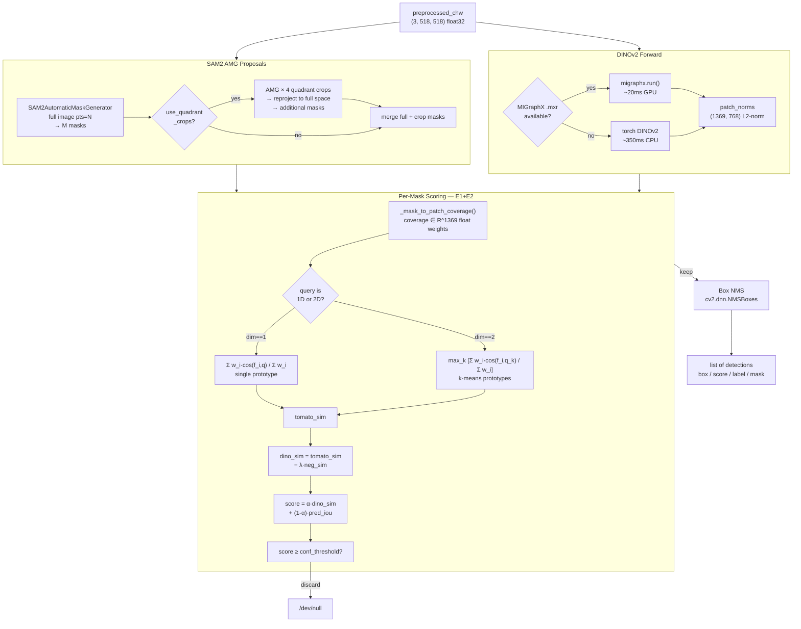
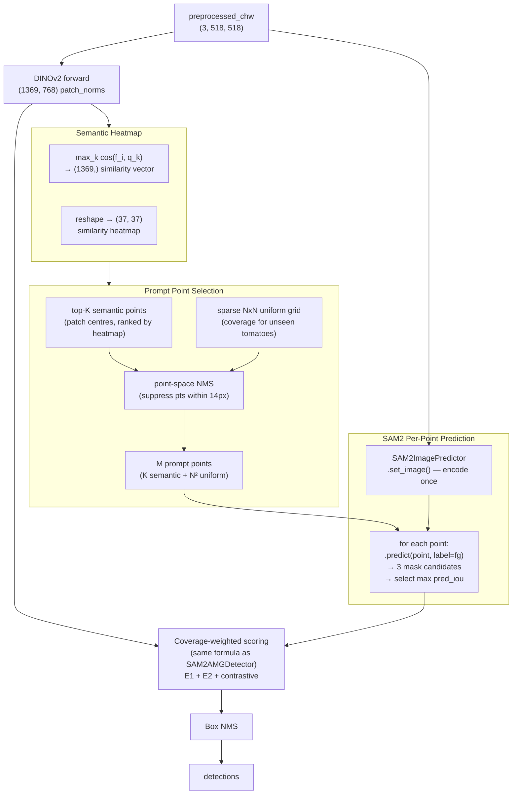
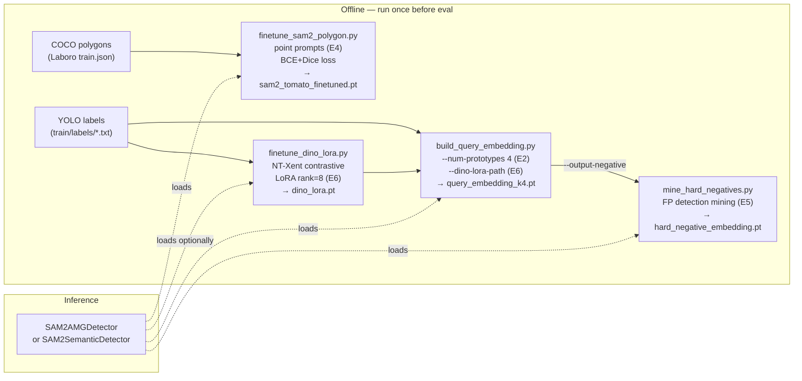

# Sprint 4 — Perception Pipeline Architecture

**Status:** Sprint 4 implemented. Baseline mAP=0.170 (Sprint 3). Target: 0.35–0.40+.

---

## 1. System Overview

```
┌──────────────────────────────────────────────────────────────────────────────┐
│                          Agrobot TOM v2 — Perception Stack                   │
│                                                                              │
│  RealSense D435i ──► ROS 2 node (tomato_detector_node.py)                   │
│                           │                                                  │
│                    preprocess_for_dino()   (518×518, ImageNet-norm)         │
│                           │                                                  │
│              ┌────────────▼────────────────────┐                            │
│              │       Detector Interface         │                            │
│              │  detect(chw) → list[dict]        │                            │
│              │  box / score / label / mask      │                            │
│              └────────┬──────────────┬──────────┘                           │
│                       │              │                                        │
│             SAM2AMGDetector   SAM2SemanticDetector                          │
│               (E1,E2,E7)           (E3)                                     │
└──────────────────────────────────────────────────────────────────────────────┘
```

The ROS 2 node is unchanged. Both Sprint 4 detectors plug in via the same interface.

---

## 2. SAM2AMGDetector Pipeline (primary, mAP baseline)



### Score formula

$$\text{score} = \alpha \cdot \left(\max_k \frac{\sum_i w_i \cos(f_i, q_k)}{\sum_i w_i} - \lambda \cdot \frac{\sum_i w_i \cos(f_i, n)}{\sum_i w_i}\right) + (1-\alpha) \cdot \text{pred\_iou}$$

where:
- $f_i \in \mathbb{R}^{768}$: L2-normalised DINOv2 patch token at position $i$
- $w_i \in [0,1]$: fraction of patch cell $i$ covered by the SAM2 mask (E1)
- $q_k \in \mathbb{R}^{768}$: k-th k-means prototype of training tomato patches (E2)
- $n \in \mathbb{R}^{768}$: negative embedding (background-mean or hard-negative from E5)
- $\text{pred\_iou}$: SAM2's own mask quality score
- $\alpha$: `dino_score_weight` (default 1.0 = DINOv2 only)
- $\lambda$: `negative_weight` (default 1.0)

---

## 3. SAM2SemanticDetector Pipeline (E3 — new)



**Key difference from AMG:** SAM2AMGDetector runs 400 blind grid prompts; SAM2SemanticDetector runs ~48+16=64 semantically-placed prompts. DINOv2 pre-filters where to look. Expected: same or better recall at ~4× lower decoder cost.

---

## 4. Training & Embedding Pipeline



---

## 5. File Map — What Does What

| File | Role | Status |
|---|---|---|
| `detectors/sam2_amg_detector.py` | Primary detector — AMG + DINOv2 scoring | **Active, Sprint 4** |
| `detectors/sam2_semantic_detector.py` | E3 detector — heatmap-guided points | **Active, Sprint 4** |
| `detectors/dino_sam2_detector.py` | Sprint 2 detector — DINOv2 proposals + SAM2 refine | Active (ablation baseline) |
| `tools/finetune_sam2_polygon.py` | SAM2 decoder fine-tune with point prompts (E4) | **Active, Sprint 4** |
| `tools/finetune_dino_lora.py` | DINOv2 LoRA training (E6) | **Active, Sprint 4 — run on NucBox** |
| `tools/build_query_embedding.py` | Build k-prototype query embedding (E2) | **Active, Sprint 4** |
| `tools/mine_hard_negatives.py` | Mine FP-based hard negative embedding (E5) | **Active, Sprint 4** |
| `tools/compile_migraphx.py` | Compile ONNX → MIGraphX .mxr (E8) | **Active, run on NucBox when ROCm unblocked** |
| `tools/export_dino_onnx.py` | Export DINOv2 to ONNX | Active (prerequisite for E8) |
| `tools/finetune_sam2_decoder.py` | Sprint 3 rect-proxy fine-tuner | **Superseded** — kept for reference |
| `eval/run_eval.py` | Eval harness — all detectors, all flags | **Active, Sprint 4** |
| `eval/metrics.py` | mAP@0.5 AP calculation | Active |
| `eval/visualize.py` | HTML report generator | Active |

---

## 6. What's Obsolete — Should You Delete It?

**Keep, do not delete:**
- `dino_sam2_detector.py` — still the `dino_sam2` / `dino_only` ablation baseline in run_eval.py.
- `finetune_sam2_decoder.py` — keep as historical reference showing why rect-proxy failed (mAP=0.000).
- `models/query_embedding.pt` — fallback single-prototype embedding; still works with the detector.
- `models/negative_embedding.pt` — background-mean negative; kept until hard-negative is validated.

**Nothing should be deleted.** The old files are either still active or serve as ablation baselines.

---

## 7. Experiment-to-mAP Expectation

| Experiment | Change | Δ mAP | Status |
|---|---|---|---|
| Baseline (S3.10) | pts=20, polygon FT (box prompts) | — | **0.170** |
| E1+E2+E4 (S4.1, failed) | k4 query + hard neg λ=1.2 (wrong query at mining) | −0.10 | Over-suppression diagnosed |
| **E1+E2+E4 (S4.2)** | **k4 query + background-mean neg λ=1.0** | **+0.117** | **0.287 ✓ NEW BEST** |
| E5 Hard negatives (corrected) | Re-mine with k4 query at λ=0.5 | TBD | Run next |
| E3 Semantic AMG | DINOv2-guided point prompts | TBD | Run next |
| E7 Quadrant crops | 4× crop multi-scale | TBD | Run next |
| E6 LoRA DINOv2 | Adapted features | TBD | Needs ROCm |

**Recall wall:** At mAP=0.287, precision=0.72, recall=0.42. The AMG uniform grid at pts=20 (26px spacing) physically misses dense clusters. Next experiments target recall > 0.50.
